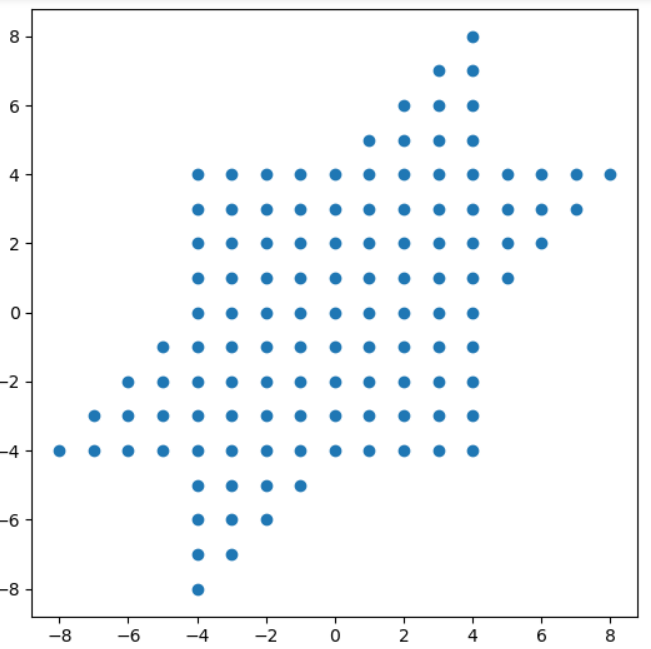

# 哈希表与哈希冲突

## 哈希表简介

哈希表又称散列表，通过键值对来储存数据的数据结构

哈希表应该满足这样的条件：通过需要查找的键值，可以直接快速地找到内存中地某个位置

这就要求任意的键值和内存中的某个位置应该符合数学上的单射关系

## 哈希函数简介

### 哈希函数

要让键值对应到内存中的位置，就要为键值计算索引

根据键值计算索引的函数就叫做哈希函数，也称散列函数

事实上，可以理解成哈希函数$f(x):  key \rightarrow index$，$key \stackrel{index}\rightarrow value$

### 哈希冲突

事实上，哈希函数不一定是一个可逆的映射

换句话说它可能不是一个单射：有些键经过索引以后找到的索引并不一定相同

这种情况被称之为哈希冲突，在作业《数据结构2_开散列法和闭散列法》将会具体地介绍这两种方法

## 哈希表设计与应用

### 问题情景：跳棋棋盘中的坐标构建

2021届图灵班的大作业《跳棋游戏》中要求实现可以多房间联机、嵌入人工智能托管的跳棋程序

很明显，在设计之初如果能够设计出对应关系简单，存取效率出色的坐标系统和坐标存取机制，能够为后续的多房间联机以及人工智能托管步骤打下不错的基础

### 哈希表设计思路

- 棋盘坐标设计思路

  - 思路一：矩阵变换法
    - 我们可以通过以基底$(1,0)$和坐标$(\frac{1}{2},\frac{\sqrt{3}}{2})$建立坐标系，再通过相应的线性变换即可获得原始坐标的位置分布

    - <center></center>

  - 思路二：单位不一法
    - 我们通过以竖直方向的两行棋子之间的距离为竖直方向单位长度，水平方向的两颗棋子之间的距离的一半为水平方向单位长度

  - 很明显，思路一的优势在于竖直方向和水平方向的单位长度一致，事实上本次大作业统一服务端和客户端的信号时就采用了这种方法。而我为了开发时坐标上有更加良好的易用性、直观性和可直接辨别性选择了第二种方法，为此我开发了`coord2standardCoord`和`standardCoord2coord`两个函数进行转换

- 哈希表键值匹配设计

  -  一般方法：给出棋子坐标(x,y)，然后通过(x,y)为参数遍历整个棋盘的所有已经定义的坐标，获取对应的坐标点
        
        > 将坐标对象集定义为Coord coords[121]，在每次得到一组坐标时遍历对应的坐标

        ```C++
            for(int i = 0; i < 120 ; ++i)
            {
                if(coords[i].getX() == x && coords[i].getY() == y)
                    coords[i].setColor(PieceColor::yellow);
            }
        ```

  - 基于哈希表数据结构设计的方法：直接将数组下标和坐标对应
        
    > 坐标数组初始化操作
        
    ```C++
        /**
        * @brief Room::initCoords 初始化坐标数组的下标和坐标的对应关系
        */
        void Room::initCoords()
        {
            for (int i = 0; i < 25; ++i)
            {
                for (int j = 0; j < 17; ++j)
                {
                    coords[i][j].setX(i - 12);
                    coords[i][j].setY(j - 8);
                    coords[i][j].setHaveSlot(false);
                    coords[i][j].setColor(PieceColor::null);
                }
            }
        }
    ```

    > 在这里，哈希函数就是一个线性函数，key就是我们设需要的坐标，index则是这个坐标在数组中的下标，而value就是坐标结构体
        
    ```C++
        // 使用示例：以下语句能够在程序中直接获取对应棋子
        coords[x + 12][y + 8].setColor(PieceColor::yellow);
    ```

### 时间复杂度分析

- 在不使用哈希表优化这一结果的情况下，每次查找的时间复杂度很明显为$O(n)$，$n$指的是待查坐标的数量
- 在使用哈希表以后，每次查找的时间复杂度为$O(1)$，与待查坐标的数量无关

### 程序清单

重要的哈希表思想运用主要在报告上的代码中，程序清单的程序是包含了具体情境的文件

程序是`coord.h`和`coord.cpp`，其中包含了坐标的结构体定义和坐标的相关函数实现，在`/coding/code1`路径下
