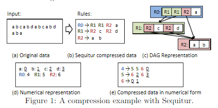
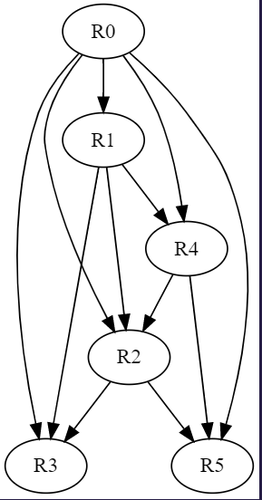

# 记忆化搜索

## 记忆化搜索算法简介

记忆化搜索是一种通过记录已经遍历过的状态的信息，从而避免对同意状态重复遍历的搜索实现方法

记忆化搜索中的每种状态事实上都只会被访问一次，事实上，记忆化搜索也是一种动态规划。

## 记忆化搜索实现方法

- 方法一
  - 写出情景的 dp 状态方程
  - 根据 dp 状态方程写出 dfs 函数
  - 添加记忆化数组
- 方法二
  - 写出情景的 dfs 程序
  - 将 dfs 改成“无需外部变量”的 dfs
  - 添加记忆化数组 

## 记忆化搜索应用实例 —— 基于规则的压缩文本分析技术

> 注：引用发表于VLDB的文献《Efficient Document Analytics on Compressed Data:Method, Challenges, Algorithms, Insights》Feng Zhang, Jidong Zhai, Xipeng Shen, Onur Mutlu, Wenguang Chen

### 前置定义
  - 文本单元，用小写字母$a,b,c,d···$表示，表示一个文本中的最小不可分割单元
  - 规则指的是一系列文本单元的集合，事实上规则还可以由规则组成
  - 压缩：将一串只由文本单元构成的文本压缩成由“规则”和文本单元组成的序列，我们使用$r_i$表示
    > 事实上，文本单元也可以看成只含有单个文本单元的集合

    > 下面的图中给出了文本单元的压缩情况

    

### 任务描述
  - 现在，有一个已经被压缩过的文本，即它的文本内容为$r_1,r_2,r_3,···,a,b,r_4,r_5,c···$
  - 每个文本单元中都包含了一些单词，现在我们要求解整篇文本的单词数量

### 算法设计

- 文本分析问题到 DAG 遍历图分析问题的转换

我们可以将所有的文本设置为初始文本 $R_0$，然后不断通过相同文本单元整合的方式将文本整合为大量重复的单元

假设一篇文本中经过压缩得到的文本单元关系如下

$R_0 = R_1 + R_2 + R_3 + R_4 + R_5$

$R_1 = R_2 + R_3 + R_4$

$R_2 = R_3 + R_5$

$R_4 = R_2 + R_5$

可以通过以下得方式进行表示

显然，这个图是一个有向无环图，可以使用 DAG 相关算法进行处理

- 无重复路径遍历降低遍历时间开销

由于文档分析任务已经被设计成为了有向无环图分析任务，因此采用单向遍历的方法就能够实现全图的无回顾遍历

可以考虑采用 DAG 遍历算法中的后序遍历法，从图的末端进行遍历，一旦读取到一个规则中含有的单词数，并维护一个队列来进行这项操作，详见作业《算法7_基于DAG图的拓扑排序：Kahn算法》

本题采用另一种方式，即递归算法进行实现

- 记忆化搜索技术的导入和应用（通过添加记忆化数组实现）

在递归的过程中，存在大量的中间结果重用现象，如果对这些重复进行递归，就会出现不必要的时间开销，因此需要维护一个记忆化数组进行时间复杂度缩减

## 本次作业小结

记忆化搜索的关键在于：不论采用递推或是递归的方法

如果在一个计算过程中存在大量的中间结果重用现象，应该考虑对中间结果进行存储，方便进行直接重用，绕开复杂过程

论文中将文本分析问题转化为 DAG 有向无环图问题的思路也非常巧妙，体现了计算机抽象的强大实力在于将看似无关问题进行本质相同的转化，这点方法也很引发人深思。

## 代码清单:`/coding/code8.cpp`