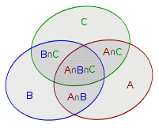

# 容斥原理在前缀和中的应用

## 前缀和介绍

“前缀和是一种重要的预处理，能大大降低查询的时间复杂度。可以简单理解为数列的前 n 项的和”

事实上 C++ 标准库已经实现了前缀和函数 std::partial_sum，定义在头文件 `<numeric>` 中，利用这个函数就可以方便地使用前缀和预处理来完成一些复杂度较高的问题。

### 前缀和算法示例

- 题目描述

数组 A 中有 N 个正整数，要求一个新的数组 B ，新数组的第 i 个数 B[i] 是原数组 A 第 0 到第 i 个数的和

- 算法思路

将 B[0] = A[0] 作为初始项，在 i >= 1 时则 B[i] = B[i-1] + A[i].

- 实现代码

```C++
#include <iostream>
int N, A[100000], B[100000];
int main() 
{
    std::cin >> N;
    for (int i = 0; i < N; i++) 
    {
        cin >> A[i];
    }
    B[0] = A[0];   // 前缀和数组的第一项和原数组的第一项是相等的。
    for (int i = 1; i < N; i++) 
    {
        B[i] = B[i - 1] + A[i];  // 前缀和数组的第 i 项 = 原数组的 0 到 i-1 项的和 + 原数组的第 i 项。
    }
    for (int i = 0; i < N; i++) 
    {
        std::cout << B[i] << " ";
    }
    return 0;
}
```

## 基于容斥原理的高维前缀和方法

### 容斥原理介绍

如下图，根据直接观察我们可以得到$|A\cup B \cup C| = |A|+|B|+|C|-|A\cap B|-|B \cap C| - |C \cap A|+|A \cap B \cap C|$，将这个结论推广到一般情况，就是我们所熟悉的容斥原理

<center></center>

### 基于容斥原理的高维前缀和计算思路

比如我们有如下矩阵：

$$ M = \begin{bmatrix}
1 & 2 & 3 & 4 & 5\\
6 & 7 & 8 & 9 & 10\\
11 & 12 & 13 & 14 & 15\\
16 & 17 & 18 & 19 &20
\end{bmatrix}$$

设$sum_{ij} = \Sigma M_{xy} , x=1,2,···,i;y=1,2,···,j$

根据容斥原理，下式成立：

$sum_{ij} = sum_{i-1,j}+sum_{i,j-1}-sum_{i-1,j-1}+M_{ij}$

### 示例

- 题目描述

在一个$n\times m$的只包含 0 和 1 的矩阵中找出一个不包含 0 的最大正方形，输出边长。

- 算法思路

如果一个矩阵中不包含 0 ，则这个矩阵的元素全部为 1 ，那么该矩阵的二维前缀和就会等于该矩阵的 1 的个数，即该矩阵的空间大小

计算二维前缀和可以采用我们刚刚引入的容斥原理来实现

- 实现代码

```C++
#include <algorithm>
#include <iostream>
int suma[100][100];
int sumb[100][100];

int main()
{
    int n, m;
    std::cin >> n >> m;

    for (int i = 1; i <= n; i++)
    {
        for (int j = 1; j <= m; j++)
        {
            std::cin >> suma[i][j];                                                         // 输入矩阵
            sumb[i][j] = sumb[i][j - 1] + sumb[i - 1][j] - sumb[i - 1][j - 1] + suma[i][j]; // 求前缀和
        }
    }

    int ans = 1;

    int k = 2;
    while (k <= std::min(n, m)) // 判断条件
    {
        for (int i = k; i <= n; i++)
        {
            for (int j = k; j <= m; j++)
            {
                if (sumb[i][j] - sumb[i - k][j] - sumb[i][j - k] + sumb[i - k][j - k] == k * k) // 如果这个小矩阵的和为k*k，即每一个元素都是 1
                {
                    ans = std::max(ans, k); // 统计答案
                }
            }
        }
        k++;
    }
    std::cout << ans << std::endl;
    return 0;
}
```

### 时间复杂度分析

对于一维前缀和算法，容易看出其前缀和操作复杂度为$O(n)$

对于二维前缀和算法，也不难求出其前缀和操作复杂度为$O(nm)$

## 代码清单

- `/coding/code9/prefix_sum1.cpp`  一维前缀和代码示例
- `/coding/code9/prefix_sum2.cpp`  二维前缀和代码示例